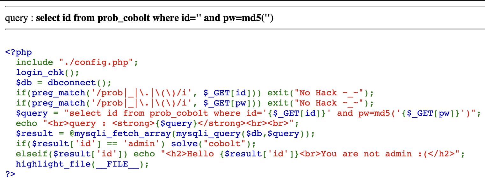

This is the challenge.
Here you can see that they just need 'admin' in place of 'id'.

The URL be like
(https://los.rubiya.kr/chall/gremlin_280c5552de8b681110e9287421b834fd.php/?id=admin%27;%23)

This Should solve it.

%27 - refers to ' (Single Quotes)
%23 - refers to '#'