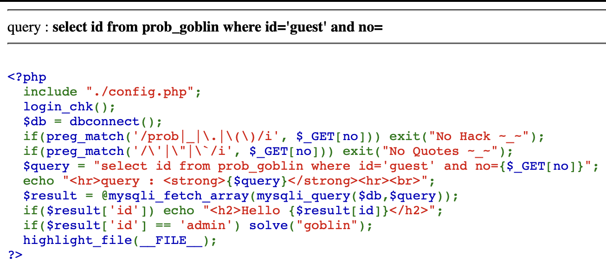

This is the challenge.
Here you can see that they just need 'admin' in place of 'id'.
But admin is aldready given as 'guest'.

We can use a OR command in order to do it, but the issue is they dont accept quote(').
So we should give the input in other ways like char, hex, etc.

The URL be like
(https://los.rubiya.kr/chall/goblin_e5afb87a6716708e3af46a849517afdc.php?no=0%20or%20id=char(97,100,109,105,110))
This Should have solved it.

%20 - refers to ' ' (space)