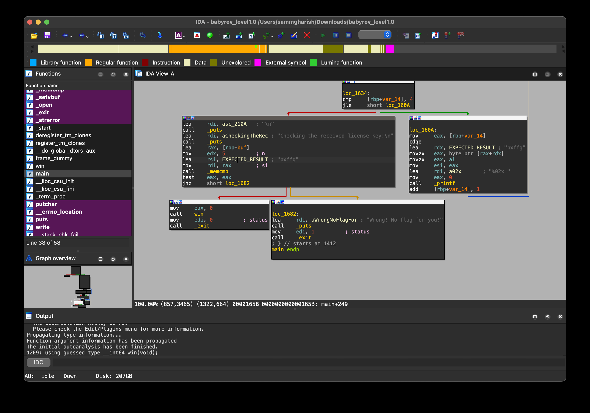

Let's begin our journey into the world of reverse engineering.  

First, open the VSCode workspace.  
Navigate to the `/challenge` directory.  
Execute the file using `./<file_name>`.  
To perform reverse engineering on the file, we must first have it in our local environment.  
One efficient method is to initiate an HTTP Python server and download the file.  
Use `python3 -m http.server`.  

Once the file is accessible locally, reverse engineering becomes straightforward.  
I typically utilize tools such as IDA or Ghidra.  

Here, the expected text is `pxffg`.  

Entering this text yields the flag.  
<!-- Flag: ~pwn.college{4IB7W1DNaBNHILvJIY8oehGKHCo.0VM1IDL4UDOzQzW}~ -->
We can now proceed to the next level.
