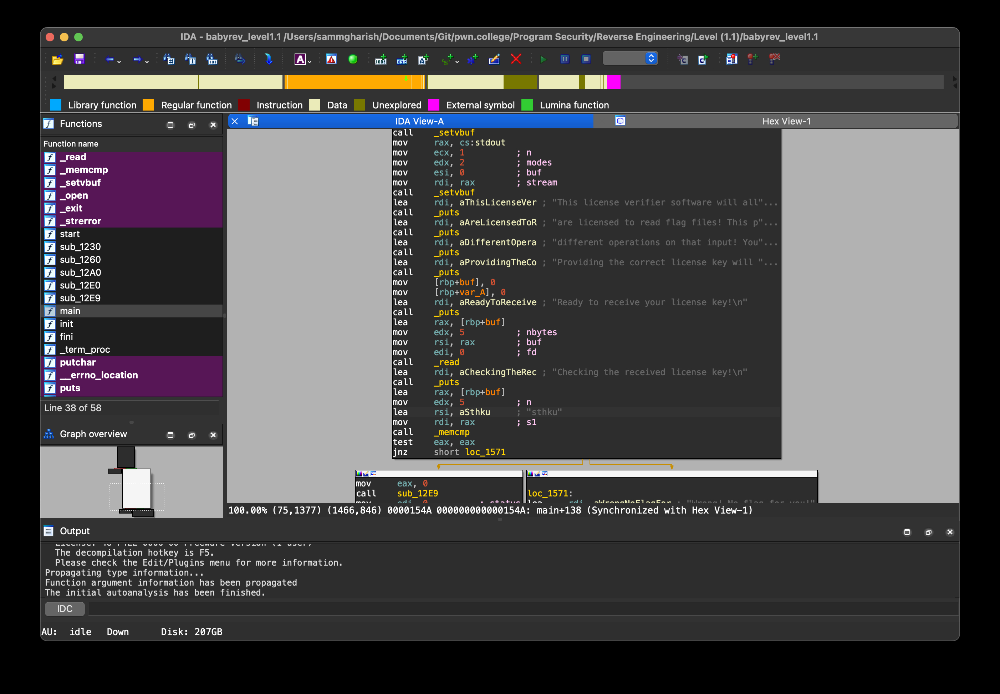

Let's now move to the third level.  

As usual, we can retrieve the file using a Python server.  

Then, we use IDA to reverse engineer it.  

We can see that the required text is `sthku`.  
Once you enter that, you can obtain the flag.  
<!-- Flag: ~pwn.college{kwxEBvvPrd7sjkga1dq_Auzg_rY.0lM1IDL4UDOzQzW}~ -->
Now, we can proceed to the next level.  
